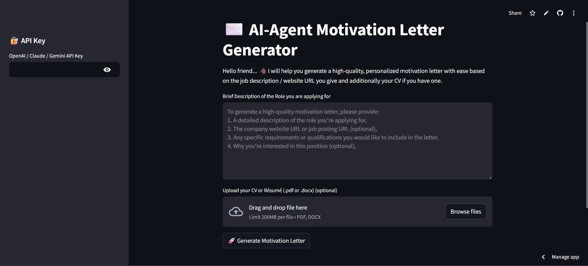

## Set up and Installation

- create venv using python `uv`

```bash
uv venv
```

- Activate the environment

```bash
.\venv\Scripts\activate
```

- Install `requirements.txt`

```bash
pip install -r requirements.txt
```

- Streamlit run

```bash
streamlit run app.py
```

## Screenshot of the outputs


